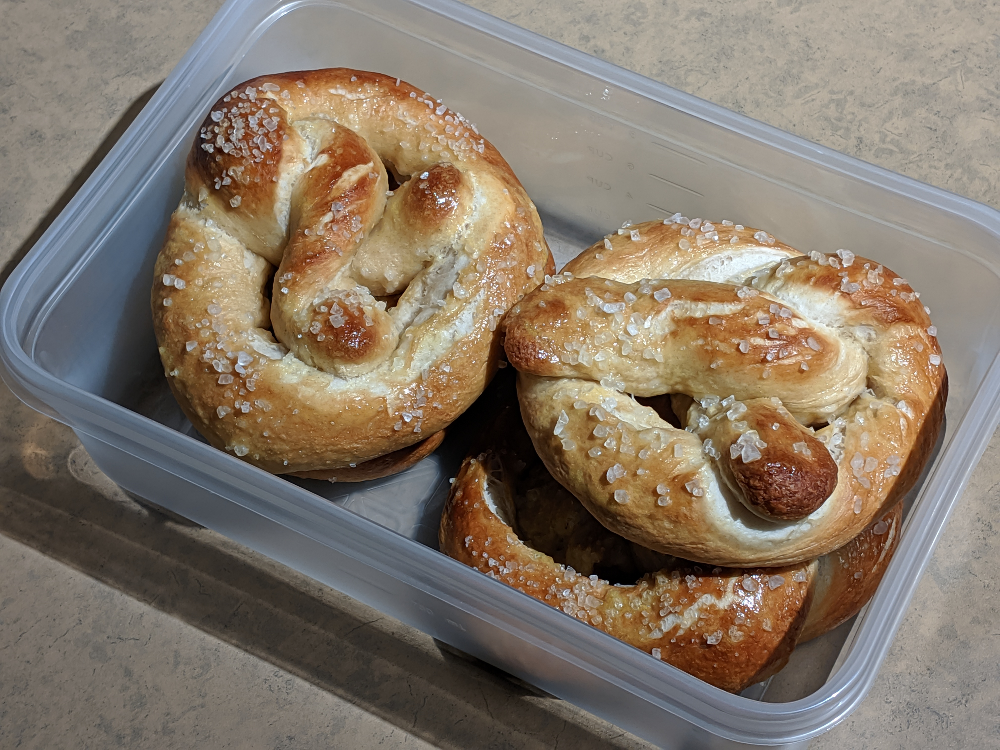

# Jesse's Code Fellows Reading-Notes
My reading journal for Code Fellows

I'm Jesse Mrozowski and I'm taking a Code Fellows bootcamp to learn how to code again after 14 years away from software development.

Link to my [github page](https://github.com/mrozowjj)

## Growth Mindset

A **growth mindset** is the idea that you can learn or improve through effort; what you know or what you can do now are things you learned before

### Three ways to keep yourself in a growth mindset

* Learn from past mistakes
* Remind yourself growth is hard work
* Take a step back. If a problem is frusterating or overwhelming and you aren't making progress take a few minute break and then try again

I'm struggling to think of a 5th thing so here's a picture of some pretzels I made.

